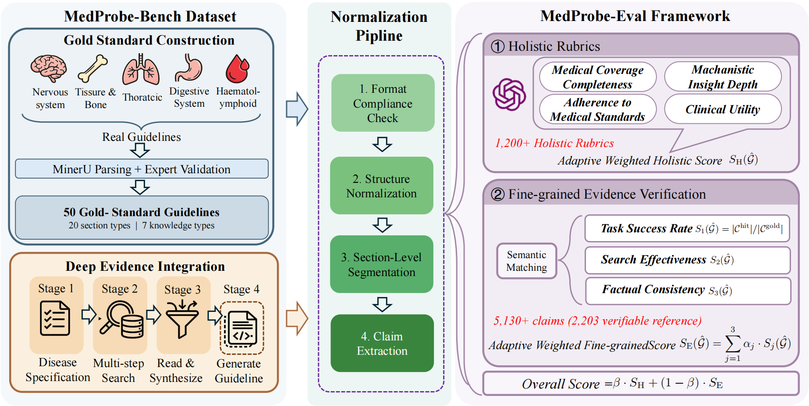

# MedProbeBench Evaluation Pipeline

[](https://arxiv.org/pdf/2604.18418)
[](./LICENSE)
[](https://www.python.org/)
[](https://huggingface.co/datasets/HanToser/MedprobeBench)
[](https://github.com/uni-medical/MedProbeBench)



A complete evaluation pipeline for medical guideline generation: from model outputs to structured extraction and MedProbe-Eval based multi-dimensional scoring.

> This document focuses on the workflow under `examples/evaluation/medprobebench`.
> This project is developed based on the [AgentScope framework](https://github.com/agentscope-ai/agentscope).

## Repository Positioning

This repository is a **benchmark for medical deep evidence integration and guideline generation**.

Following the MedProbeBench paper, this benchmark uses high-quality clinical guidelines as expert-level references and evaluates end-to-end quality of model-generated medical guideline reports, including:

- fine-grained evidence verification (claim coverage, retrieval quality, factual grounding);
- optional holistic report-level scoring with task-adaptive rubrics.

In short, this benchmark targets the full lifecycle of **medical deep research -> structured claims/citations -> reproducible evaluation**, with a two-stage MedProbe-Eval view (holistic quality + fine-grained evidence verification).

---

## 1. Pipeline Overview

```text
Input JSONL
   │
   ├─ Step 1: check_format
   ├─ Step 2: report_to_table
   ├─ Step 3: table_to_md
   ├─ Step 4: standardize_md
   ├─ Step 5: extract_claims
   ├─ Step 6: enrich_references
   └─ Step 7: convert_to_jsonl_format
   │
   └─ Evaluation: metric/guidebench.py
         ├─ task_success_rate
         ├─ search_effectiveness
         ├─ factual_consistency
         └─ (optional) global_eval
```

This pipeline has two major phases:

1. **Data Processing (Steps 1-7)**
  Converts raw model outputs into a normalized prediction JSONL format.
2. **Metric Evaluation (MedProbe-Eval)**
  Scores predictions against ground truth with holistic quality and fine-grained evidence verification metrics.

### Step-by-step Details


| Step | Script                       | Input                     | Output                   | Purpose                                                            |
| ---- | ---------------------------- | ------------------------- | ------------------------ | ------------------------------------------------------------------ |
| 1    | `check_format.py`            | Raw reports / JSONL items | Validated records        | Sanity-check structure and required fields                         |
| 2    | `report_to_table.py`         | Validated records         | Structured table data    | Convert free-form reports into tabular intermediate representation |
| 3    | `table_to_md.py`             | Table data                | Markdown reports         | Transform structured data into standardized markdown content       |
| 4    | `standardize_md.py`          | Markdown reports          | Cleaned markdown reports | Normalize headings, formatting, and section boundaries             |
| 5    | `extract_claims.py`          | Standardized markdown     | Claim candidates         | Extract claim units (with section context)                         |
| 6    | `enrich_references.py`       | Claims + references       | Enriched claims          | Resolve or enrich citation links (DOI/PubMed/URL)                  |
| 7    | `convert_to_jsonl_format.py` | Enriched claims           | `pred.jsonl`             | Convert final prediction artifacts to evaluation JSONL format      |


### Evaluation Stage (`metric/guidebench.py`)

For each sample, the evaluator computes:

- `task_success_rate`: whether predicted claims cover GT claims.
- `search_effectiveness`: whether predicted references recover GT references.
- `factual_consistency`: citation presence + content relevance score.
- `global_eval` (optional): holistic report quality score.

Final score is computed as a weighted combination of enabled metrics.

This aligns with the MedProbeBench paper's two-stage evaluation design: holistic rubric-based quality assessment (task-adaptive criteria) and fine-grained evidence verification over atomic claims.

### Typical Artifacts

- Raw model outputs: `research_output/<dataset>/<model>/`
- Processed intermediates: `output/<dataset>/<model>/`
- Final predictions: `datasets/<dataset>/<model>/pred.jsonl`
- Evaluation results: `results/<dataset>/<model>/...`

---

## 2. Environment Setup

### 2.1 Prerequisites

- Python 3.10+
- A working LLM API (used for report generation, claim extraction, and grading)

### 2.2 Install

Run from the repository root:

```bash
pip install -e .
pip install -r requirements.txt
```

### 2.3 Environment Variables

Configure via `.env` or shell environment variables:

```bash
export OPENAI_API_KEY="your_api_key"
export OPENAI_BASE_URL="your_base_url"   # optional
```

---

## 3. Quick Start (One Command)

Go to the benchmark directory:

```bash
cd examples/evaluation/medprobebench
```

Single model, single sample:

```bash
bash run_evaluation.sh -m gpt-4.1 -n 1 -d ./datasets/MedProbeBench.jsonl -s demo1
```

All predefined models, 50 samples:

```bash
bash run_evaluation.sh -a -n 50 -d ./datasets/MedProbeBench.jsonl -s batch1
```

`run_evaluation.sh` arguments:

- `-m MODEL`: evaluate one model
- `-a`: evaluate all predefined models in the script
- `-n SAMPLES`: maximum number of samples (default: `1`)
- `-d DATASET`: dataset path (default: `./datasets/MedProbeBench.jsonl`)
- `-s SUFFIX`: suffix for result directory (use different values for different runs)
- `-h`: show help

---

## 4. Step-by-Step Workflow

```bash
export TEST_MODEL="gpt-4.1"
export MAX_SAMPLES=1
```

### Step A. Prepare Prediction File (`pred.jsonl`)

```bash
# Option 1 (recommended in this checkout): use existing prediction file
export PRED_PATH="./datasets/MedProbeBench/$TEST_MODEL/pred.jsonl"

# Option 2: if you maintain your own generation scripts, produce `pred.jsonl`
# and set PRED_PATH to that file.
```

If you already have `PRED_PATH`, you can skip Step B and Step C.

### Step B. (Optional) Report Generation

```bash
python openai_generator.py \
  --prompt-dir ./prompts/MedProbeBench/ \
  --prompt-version v1 \
  -o ./research_output/MedProbeBench/"$TEST_MODEL"/ \
  --max-samples "$MAX_SAMPLES" \
  --model "$TEST_MODEL"
```

### Step C. (Optional) Data Processing Pipeline

```bash
python run_pipeline.py \
  -i ./research_output/MedProbeBench/"$TEST_MODEL" \
  -o ./output/MedProbeBench/"$TEST_MODEL" \
  --model "gpt-4o-mini" \
  --output-jsonl ./datasets/MedProbeBench/"$TEST_MODEL"/pred.jsonl \
  --use-llm-enrich \
  --force-extract
```

Common `run_pipeline.py` flags:


| Flag               | Description                                        |
| ------------------ | -------------------------------------------------- |
| `-i`               | Input directory (raw reports / intermediate files) |
| `-o`               | Output directory                                   |
| `--output-jsonl`   | Final `pred.jsonl` output path                     |
| `--use-llm-enrich` | Use LLM-based reference enrichment                 |
| `--force-extract`  | Re-extract claims even if cache exists             |
| `--skip-claims`    | Skip claim-related steps (5-7)                     |
| `--skip-enrich`    | Skip reference enrichment                          |
| `--workers N`      | Number of parallel workers (default: 10)           |


### Step D. Evaluation

```bash
bash run_medprobebench.sh \
  --data_path "$PRED_PATH" \
  --results_dir "./results/MedProbeBench/$TEST_MODEL" \
  --gt_path "./datasets/MedProbeBench.jsonl" \
  --max_samples "$MAX_SAMPLES" \
  --suffix "demo1" \
  --global_judge_model "gpt-4.1" \
  --grader_model "gpt-4.1"
```

Step D follows a **two-stage evaluation** setup:

- **Stage 1 (Fine-grained Evidence Verification)**: `task_success_rate` + `search_effectiveness` + `factual_consistency`
- **Stage 2 (Holistic Quality, optional)**: `global_eval` (enabled by default in `run_medprobebench.sh`, configurable via `ENABLE_GLOBAL_EVAL`)

---

## 5. Metric Summary

Two-stage metric composition:

- **Stage 1 / Fine-grained**: `task_success_rate` (claim coverage), `search_effectiveness` (evidence retrieval recall), `factual_consistency` (citation-grounded factual alignment)
- **Stage 2 / Holistic (optional)**: `global_eval` for report-level quality assessment
- Final score is computed as a weighted combination of enabled metrics in `metric/guidebench.py`

---

## 6. Directory Structure (Core)

```text
examples/evaluation/medprobebench/
├── __init__.py
├── eval.py
├── eval.sh
├── eval_utils.py
├── openai_generator.py
├── requirements.txt
├── run.sh
├── run_evaluation.sh
├── run_generation_timing.sh
├── run_medprobebench.sh
├── run_pipeline.py
├── utils/
│   └── preprocess.py
├── datasets/
│   ├── MedProbeBench.jsonl
├── metric/
│   ├── cache_urls_jina.py
│   ├── factual_consistency.py
│   ├── guidebench.py
│   ├── guidebench_global_scorer.py
│   ├── search_effectiveness.py
│   └── task_success_rate.py
└── test_utils/
    ├── api_config.json
    ├── claim_extraction_prompt_simple.md
    ├── check_format.py
    ├── convert_to_jsonl_format.py
    ├── enrich_references.py
    ├── extract_claims.py
    ├── md_utils.py
    ├── reference_config.json
    ├── report_to_table.py
    ├── standardize_md.py
    ├── table_to_md.py
    ├── cache/
    │   └── reference_cache.json
    └── reference_enrichment/
        ├── __init__.py
        ├── cache_manager.py
        ├── doi_resolver.py
        ├── llm_url_extractor.py
        ├── pmid_extractor.py
        └── pubmed_client.py
```

---

## 7. Reproducibility Tips

- Use a different `-s` suffix for each run to isolate outputs.
- Keep `--grader_model` / `--global_judge_model` fixed for fair comparisons.
- Start with `-n 1` as a smoke test, then scale up.

---

## 8. License

This project is licensed under the **Apache License 2.0**.

See the full license text in `[LICENSE](./LICENSE)`.

---

## 9. Citation

If you use this dataset or evaluation pipeline in your work, please cite:

```bibtex
@article{liu2026medprobebench,
  title={MedProbeBench: Systematic Benchmarking at Deep Evidence Integration for Expert-level Medical Guideline},
  author={Liu, Jiyao and Shen, Jianghan and Song, Sida and Li, Tianbin and Liu, Xiaojia and Li, Rongbin and Huang, Ziyan and Lin, Jiashi and Ning, Junzhi and Ji, Changkai and Luo, Siqi and Li, Wenjie and Ma, Chenglong and Hu, Ming and Xiong, Jing and Ye, Jin and Fu, Bin and Xu, Ningsheng and Chen, Yirong and Jin, Lei and Chen, Hong and He, Junjun},
  journal={arXiv preprint arXiv:2604.18418},
  year={2026}
}
```